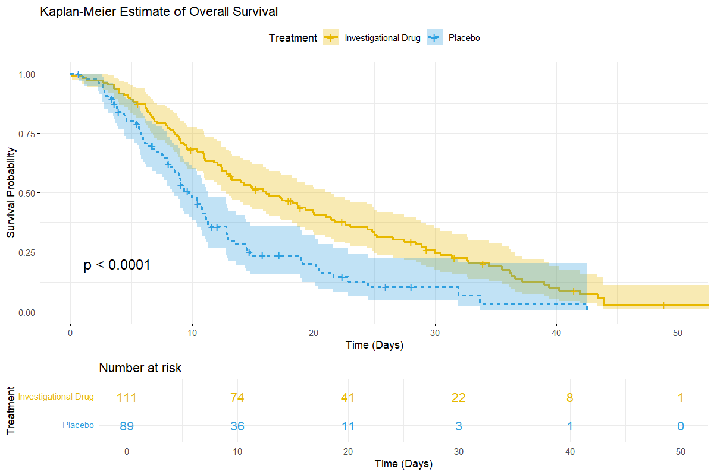
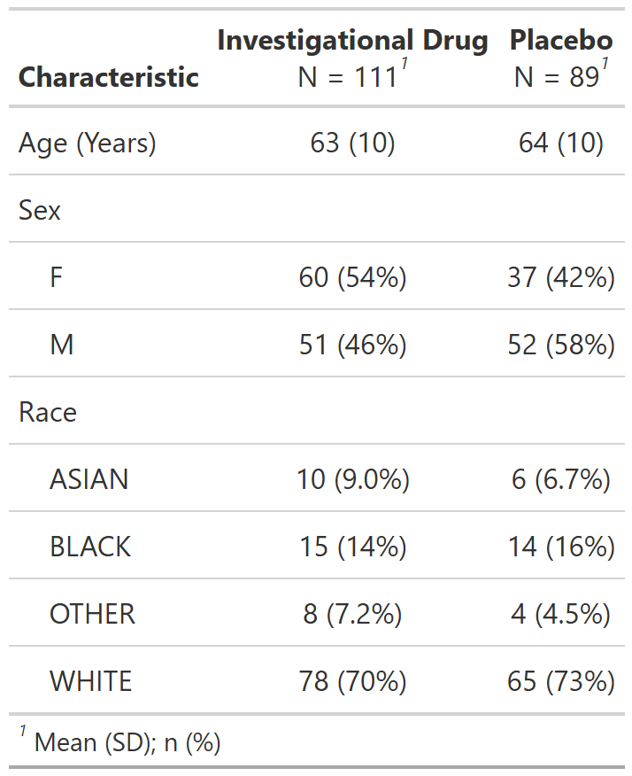
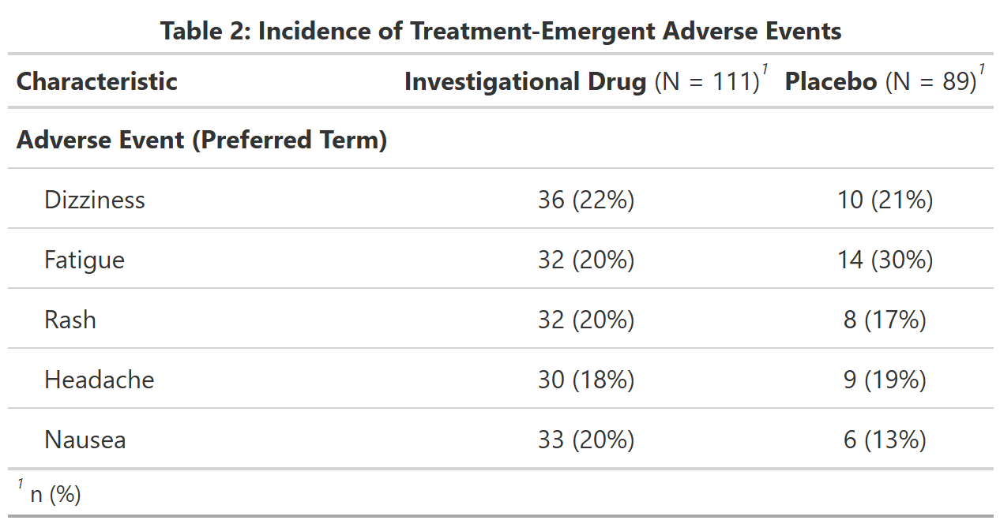

# Clinical Trial Simulation & CDISC Analysis
**Author:** Patrick Kirby Jr.
**Tech Stack:** R (Tidyverse, Survival, gtsummary)

## Project Overview
This project simulates a **Phase III Oncology Clinical Trial** to demonstrate end-to-end clinical data science workflows using **CDISC standards**. The pipeline generates synthetic subject data (ADSL), safety data (ADAE), and efficacy data (ADTTE), and performs regulatory-style statistical analysis.

## Key Features
* **CDISC Simulation:** Generated `ADSL`, `ADAE`, and `ADTTE` datasets with realistic relationships.
* **Survival Modeling:** Modeled Overall Survival (OS) using **Weibull distributions** to simulate increasing hazard rates over time (`shape=1.5`).
* **Statistical Reporting:** Produced publication-ready Tables, Listings, and Figures (TLFs).

## Results

### 1. Efficacy Analysis (Kaplan-Meier Curve)
*Modeled a statistically significant survival benefit for the Investigational Drug vs. Placebo (Log-Rank p < 0.0001).*
 
*(Note: Ensure this path matches your actual folder name, e.g., 'outputs' or 'output')*

### 2. Demographic Baseline (Table 1)
*Demonstrated balanced randomization across Age, Sex, and Race.*

### 3. Safety Analysis (Adverse Events)
*Summarized treatment-emergent adverse events (TEAEs) adjusted for population size.*

## Repository Structure
* `00_sim_data.R`: Data generation (Weibull & Binomial logic).
* `01_table_demographics.R`: Baseline characteristics using `gtsummary`.
* `02_analysis_survival.R`: Kaplan-Meier & Log-Rank test using `survival`.
* `03_table_safety.R`: AE incidence reporting.